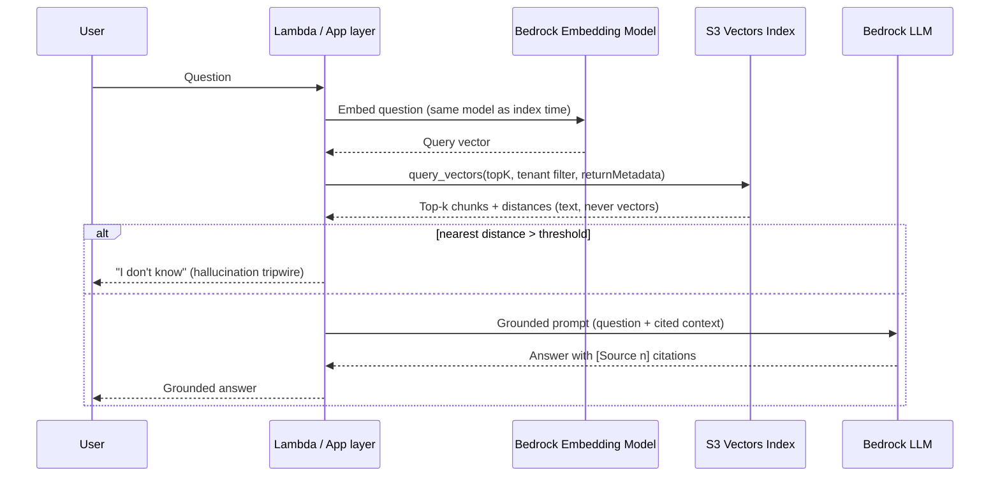

# RAG on AWS with Amazon S3 Vectors and Bedrock

A production-patterned Retrieval Augmented Generation pipeline, built from scratch with boto3. It ingests a document corpus into **Amazon S3 Vectors**, retrieves with metadata-filtered similarity search, and generates grounded, cited answers with **Amazon Bedrock**. Every architectural decision is explicit, documented, and tunable.

This is not a framework wrapper. There is no LangChain here on purpose: the goal is to demonstrate command of the underlying mechanics that frameworks abstract away, because that is where RAG systems actually fail.

## Architecture


[RAG architecture on AWS](architecture/rag-architecture.png)



## What this demonstrates

| Capability | Where |
|---|---|
| Structure-aware recursive chunking with overlap, deterministic idempotent chunk IDs | `src/rag_pipeline/chunking.py` |
| Titan Text Embeddings V2 with the index-time = query-time invariant enforced in code | `src/rag_pipeline/embeddings.py` |
| S3 Vectors lifecycle: bucket, immutable index config, batched ingestion (500/call), filtered query | `src/rag_pipeline/vector_store.py` |
| Grounded prompting with numbered citations and a distance-threshold "I don't know" tripwire | `src/rag_pipeline/generation.py` |
| Two-stage retrieval: wide recall then reranking | `src/rag_pipeline/rerank.py` |
| Labelled evaluation set, retrieval accuracy, top-k sweep, threshold tuning probe | `src/rag_pipeline/evaluate.py` |
| Unit-economics worksheet: monthly cost at N queries/day over an M-chunk corpus | `src/rag_pipeline/cost_model.py` |
| Multi-tenant isolation via server-side metadata filters | `vector_store.query_index`, `pipeline.py --tenant` |
| Decision records: store selection, managed vs DIY, security checklist | `docs/architecture-decisions.md` |
| The discovery framework I would run before building any of this | `docs/discovery-questions.md` |
| Design-review Q&A | `docs/design-qa.md` |

## Why S3 Vectors

S3 Vectors is object storage with native vector indexes: up to 2 billion vectors per index, cosine or Euclidean distance, and storage costs far below dedicated vector engines (AWS positions it at up to 90 percent cheaper). Latency is sub-second cold and around 100 ms warm, which disappears inside an LLM response measured in seconds. For an internal knowledge assistant, that trade is exactly right; for high-QPS realtime search it is exactly wrong, and `docs/architecture-decisions.md` covers when I would choose OpenSearch Serverless, Aurora pgvector, or Bedrock Knowledge Bases instead.

Two properties of the service shape the code more than any other:

1. **Index configuration is immutable.** Dimension, distance metric and non-filterable metadata keys are fixed at creation. Changing the embedding model means a new index and a full re-ingest, so every chunk records its `chunking_version` and uses deterministic IDs to make re-ingestion idempotent.
2. **The store holds vectors AND text.** The LLM never sees a vector. Raw chunk text is stored as non-filterable metadata beside its embedding, so retrieval returns everything the prompt needs in one call.

## Quickstart

Prerequisites: an AWS account with S3 Vectors available in your region, Bedrock model access enabled for `amazon.titan-embed-text-v2:0` and at least one text generation model (Claude or Nova), and credentials configured locally.

```bash
git clone https://github.com/<your-user>/rag-on-aws-s3-vectors.git
cd rag-on-aws-s3-vectors
python -m venv .venv && source .venv/bin/activate
pip install -r requirements.txt

export AWS_REGION=us-east-1
export VECTOR_BUCKET_NAME=my-rag-demo-bucket   # stable name so runs reuse the index

# 1. Chunk, embed and index the sample corpus
python -m src.rag_pipeline.pipeline ingest

# 2. Ask grounded questions
python -m src.rag_pipeline.pipeline ask "How many weeks of parental leave do primary caregivers get?"

# 3. Enforce tenant isolation at the retrieval layer
python -m src.rag_pipeline.pipeline ask "What is the client entertainment limit?" --tenant acme

# 4. Watch a question the corpus cannot answer get refused, not hallucinated
python -m src.rag_pipeline.pipeline ask "What is our policy on free lunches?"

# 5. Compare vector-order vs reranked answers
python -m src.rag_pipeline.pipeline rerank-demo "What happens if I leave after education reimbursement?"

# 6. Measure retrieval accuracy against the labelled evaluation set
python -m src.rag_pipeline.pipeline evaluate

# 7. Model the unit economics of a production-scale workload
python -m src.rag_pipeline.pipeline cost

# 8. Tear everything down
python -m src.rag_pipeline.pipeline cleanup --confirm
```

Estimated cost of a full demo run is a few cents (small corpus, on-demand Bedrock inference, S3 Vectors storage measured in kilobytes). Always run cleanup.

## The knobs, in order of leverage

Most RAG quality conversations start with the model. That is the fourth most important variable. In order of impact:

1. **Chunking strategy and size** (`CHUNK_STRATEGY`, `CHUNK_SIZE`, `CHUNK_OVERLAP`). Split a policy across a chunk boundary and no downstream component recovers the answer. Compare `fixed` at 200 characters against `recursive` at 400 and watch retrieval accuracy move.
2. **Embedding model alignment with the domain.** Generic embeddings on specialised vocabulary (legal, medical, finance) are a common silent failure; domain-tuned embedding models can move retrieval accuracy by tens of points on identical documents.
3. **Reranking.** Vector similarity finds chunks about the topic; a reranker finds chunks that answer the question. This repo demonstrates the pattern with an LLM reranker; production should use Cohere Rerank on Bedrock or Knowledge Bases built-in reranking.
4. **The LLM.** With retrieval fixed, swapping generation models changes tone more than correctness.

Every knob lives in `src/rag_pipeline/config.py`, and `evaluate.py` exists so that turning a knob produces a number, not an opinion.

## Repository structure

```
rag-on-aws-s3-vectors/
├── README.md
├── LICENSE
├── requirements.txt
├── .env.example
├── architecture/
│   └── rag-architecture.png
├── data/
│   └── sample_corpus.py          # fictional HR corpus with tenant/access metadata
├── docs/
│   ├── architecture-decisions.md # store selection, managed vs DIY, security checklist
│   ├── discovery-questions.md    # the qualification framework that precedes architecture
│   └── design-qa.md              # design-review questions, answered
└── src/rag_pipeline/
    ├── config.py                 # every tunable in one place
    ├── aws_clients.py
    ├── chunking.py
    ├── embeddings.py
    ├── vector_store.py
    ├── generation.py
    ├── rerank.py
    ├── evaluate.py
    ├── cost_model.py             # unit economics worksheet
    ├── cleanup.py
    └── pipeline.py               # CLI: ingest | ask | rerank-demo | evaluate | cleanup
```

## Production posture (what changes beyond the demo)

- **Security:** customer-managed KMS on the vector bucket, VPC endpoints for `s3vectors` and `bedrock-runtime`, least-privilege IAM (filtered queries with metadata need both `QueryVectors` and `GetVectors`), CloudTrail on every data-plane call, Bedrock Guardrails at generation.
- **Ingestion:** event-driven (S3 event to Lambda) rather than batch CLI, with the same deterministic chunk IDs making updates idempotent.
- **Serving:** API Gateway in front of Lambda, tenant filter derived from the authenticated token, never from the client.
- **Evaluation:** the labelled set grows with real user questions; retrieval accuracy and refusal rate become dashboard metrics, not one-off scripts.

- **Cost:** `cost_model.py` shows generation input tokens dominating the monthly bill at scale, which makes retrieval discipline (top-k, chunk size) a cost lever as well as a quality lever.

The full reasoning is in [`docs/architecture-decisions.md`](docs/architecture-decisions.md).


*Built and measured by Anu Agarwal — [linkedin.com/in/agarwalanu](https://www.linkedin.com/in/agarwalanu)*


